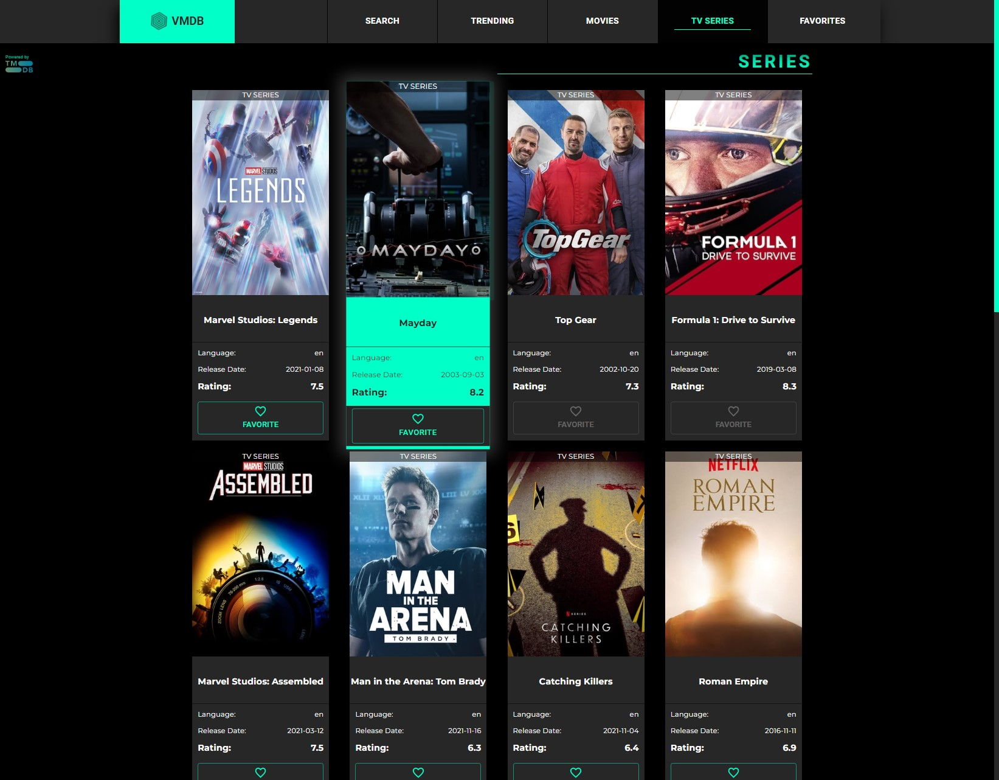
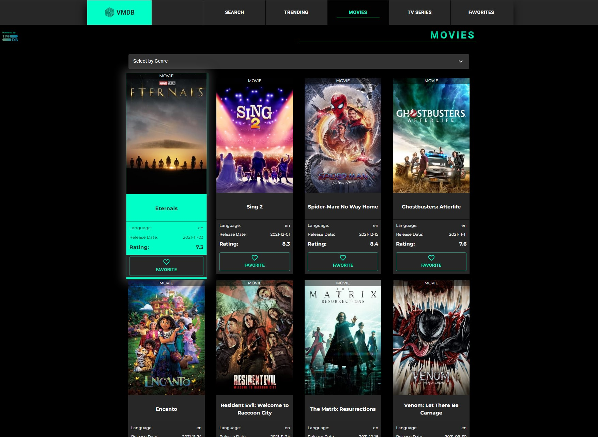
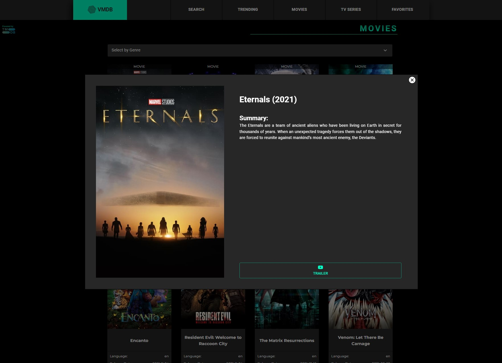
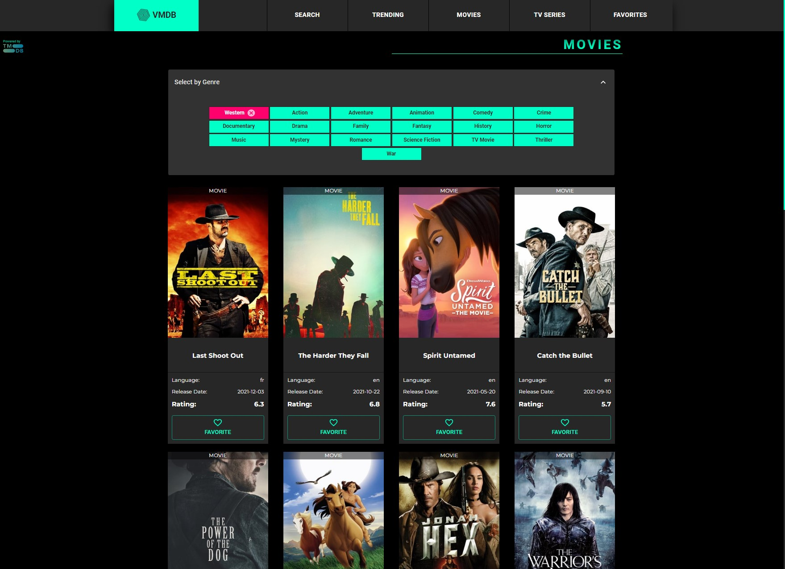
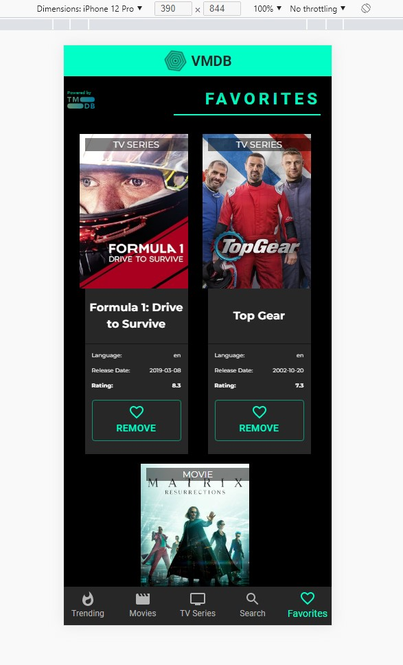
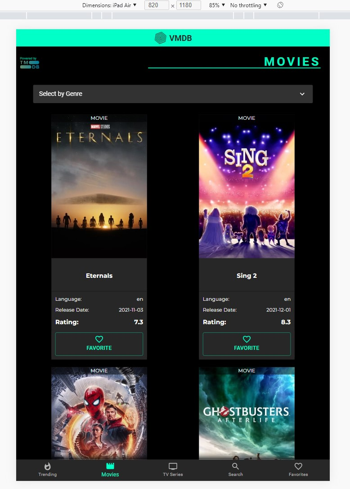
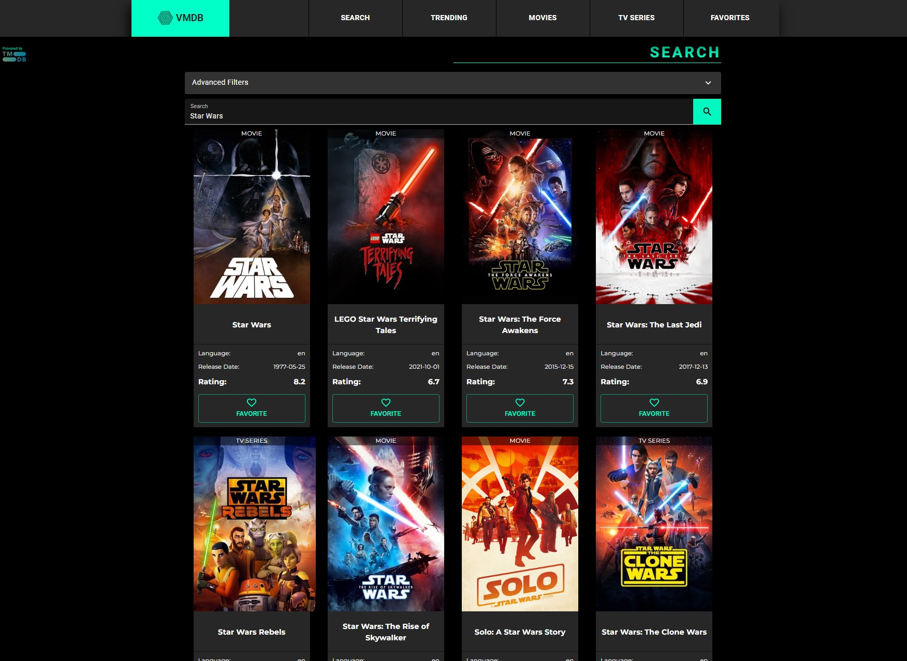
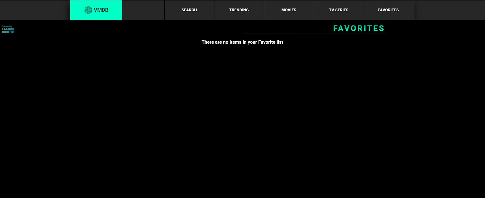
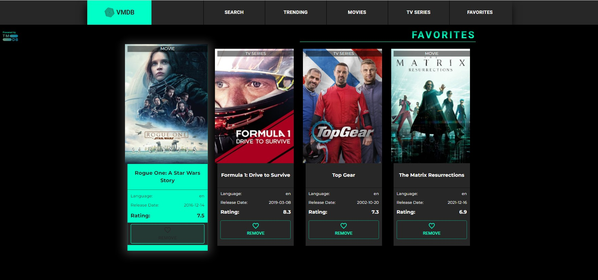

<!-- PROJECT LOGO -->
<div align="center">
  <a href="https://github.com/venmartin">
    
  </a>

  <h3 align="center">React Movie Database Application</h3>

</div>


<!-- TABLE OF CONTENTS -->
<details>
  <summary>Table of Contents</summary>
  <ol>
    <li>
      <a href="#about-the-project">About The Project</a>
      <ul>
        <li><a href="#built-with">Built With</a></li>
      </ul>
    </li>
    <li>
      <a href="#getting-started">Getting Started</a>
      <ul>
        <li><a href="#installation">Installation</a></li>
      </ul>
    </li>
    <li><a href="#license">License</a></li>
    <li><a href="#contact">Contact</a></li>
    <li><a href="#acknowledgments">Acknowledgments</a></li>
  </ol>
</details>


<!-- ABOUT THE PROJECT -->
# About The Project

## Movies and TV Series




<br>

## Ability to filter


<br>

## Responsive Design



<br>

## Search your favorite titles


<br>

## Add and remove from your own favorites list



<br>
<br>

### A simple movie database application created with React JS, powered by [The Movie Database](www.themoviedb.org).

The VMDB application allows users to browse through thousands of movies and tv series stored in the TMDB API. 
Features such as:

* Filter through genre's of movies
* Search functionality with additional filters to show Movies, TV Series or both.
* A Favorite list to add / remove your items to and from.
* Trending which provides the hottest movies rated on a weekly basis.
* Mobile and tablet friendly.

This was designed to increase my knowledge on React JS and hopefully will help any of you as well!

<p align="right">(<a href="#top">back to top</a>)</p>


### Built With

* [React.js](https://reactjs.org/)
* [Material UI (Mui)](https://mui.com/)

<p align="right">(<a href="#top">back to top</a>)</p>


<!-- GETTING STARTED -->
## Getting Started

### Installation

_Below is an example of how you can instruct your audience on installing and setting up your app. This template doesn't rely on any external dependencies or services._

1. Get a free API Key by signing up at [https://themoviedb.org](https://www.themoviedb.org/signup)
2. Clone the repo
   ```sh
   git clone https://github.com/venmartin/react-movie-watchlist.git
   ```
3. Install NPM packages
   ```sh
   npm install
   ```
4. Enter your API in `.env` / Remember to not have any spaces or " ".
   ```js
   REACT_APP_API_KEY=ENTER YOUR API ---- eg. REACT_APP_API_KEY=sfd89890sa97d8909sa0-79s78asd98
   ```
5. Run the application locally in development mode.
   ```
   npm start
   ```


<p align="right">(<a href="#top">back to top</a>)</p>

<!-- LICENSE -->
## License

Distributed under the MIT License. See `LICENSE.txt` for more information.

<p align="right">(<a href="#top">back to top</a>)</p>


<!-- CONTACT -->
## Contact

Adam Martinovic - [LinkedIn](https://www.linkedin.com/in/adam-martinovic-27a321217/)

Project Link: [https://github.com/venmartin/react-movie-watchlist](https://github.com/venmartin/react-movie-watchlist)

<p align="right">(<a href="#top">back to top</a>)</p>


<!-- ACKNOWLEDGMENTS -->
## Acknowledgments

Use this space to list resources you find helpful and would like to give credit to. I've included a few of my favorites to kick things off!

* [The Movie Database](https://themoviedb.org)
* [Material UI Documentation](https://choosealicense.com)
* [React Documentation](https://reactjs.org/docs/getting-started.html)

<p align="right">(<a href="#top">back to top</a>)</p>